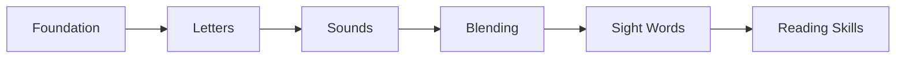

# Chapters Overview

Welcome to Reading for Kindergarten! This textbook is organized into 11 chapters that guide young learners through the fundamentals of reading.

## Chapter Structure

Each chapter builds on previous knowledge, following a carefully designed learning progression from foundational concepts to independent reading skills.

| Chapter | Title | Concepts | Category |
|---------|-------|----------|----------|
| 1 | [Getting Ready to Read](./01-getting-ready-to-read/index.md) | 15 | Foundation |
| 2 | [Learning Uppercase Letters](./02-learning-uppercase-letters/index.md) | 26 | Letters |
| 3 | [Learning Lowercase Letters](./03-learning-lowercase-letters/index.md) | 26 | Letters |
| 4 | [Hearing Sounds in Words](./04-hearing-sounds-in-words/index.md) | 13 | Phonemic Awareness |
| 5 | [Consonant Sounds](./05-consonant-sounds/index.md) | 23 | Sounds |
| 6 | [Vowel Sounds](./06-vowel-sounds/index.md) | 14 | Sounds |
| 7 | [Connecting Letters and Sounds](./07-connecting-letters-and-sounds/index.md) | 8 | Letter-Sound Links |
| 8 | [Blending Sounds into Words](./08-blending-sounds-into-words/index.md) | 15 | Blending |
| 9 | [Learning Sight Words](./09-learning-sight-words/index.md) | 20 | Sight Words |
| 10 | [Practice, Assessment, and Learning Strategies](./10-practice-assessment-strategies/index.md) | 15 | Assessment |
| 11 | [Building Reading Skills](./11-building-reading-skills/index.md) | 20 | Application & Capstone |

## Learning Progression

## How to Use This Book

1. **Start at Chapter 1** - Build foundational skills before moving forward
2. **Complete each chapter's activities** - Practice reinforces learning
3. **Take the chapter quizzes** - Check understanding before moving on
4. **Celebrate progress** - Reading is a journey worth celebrating!

## Total Concepts: 195

This textbook covers 195 carefully sequenced concepts that build the foundation for reading success.
