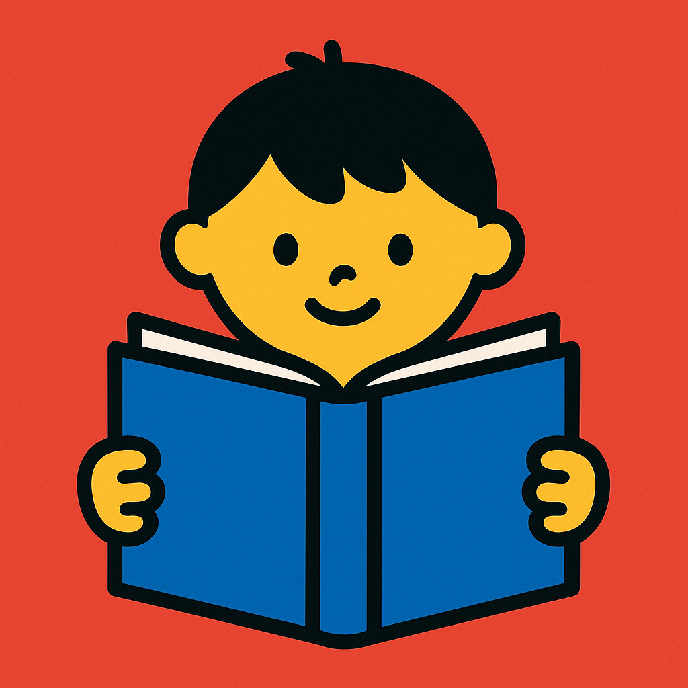

# Icon Prompt

!!! prompt
    Generate a square icon for a kids reading site using a minimalistic design style. Use a bright primary colors for a distinctive favicon.

## Result Given to ChatGPT 5.1

