# Interactive Simulations

This section contains MicroSims - interactive educational simulations designed to help kindergarten students learn reading skills through hands-on exploration.

!!! tip "Start with the Reading Progress Path"
    For the best experience, use the **[Reading Progress Path](./reading-progress-path/index.md)** to navigate through all MicroSims. It opens each activity in a new tab and tracks your progress with stars. This helps students see their learning journey and keeps track of which activities they've completed.

## What are MicroSims?

MicroSims are small, focused interactive simulations that teach specific reading skills. Each MicroSim uses p5.js for graphics, Web Speech API for audio, and provides immediate feedback to keep young learners engaged.

## Letter Recognition

- **[Talking Letters](./talking-letters/index.md)**

    
    Click letters to hear their names and sounds with speech synthesis. Toggle between uppercase and lowercase.

- **[Letter Matching Game](./letter-matching-game/index.md)**

    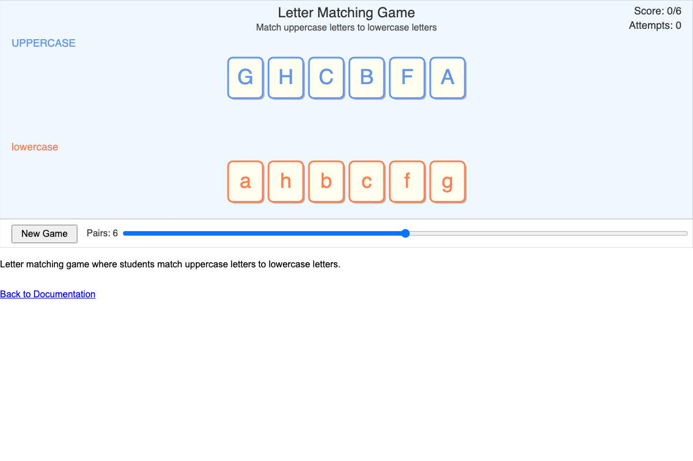
    Match uppercase letters to their lowercase partners with drag-and-drop connections.

- **[Letter Hunt](./letter-hunt/index.md)**

    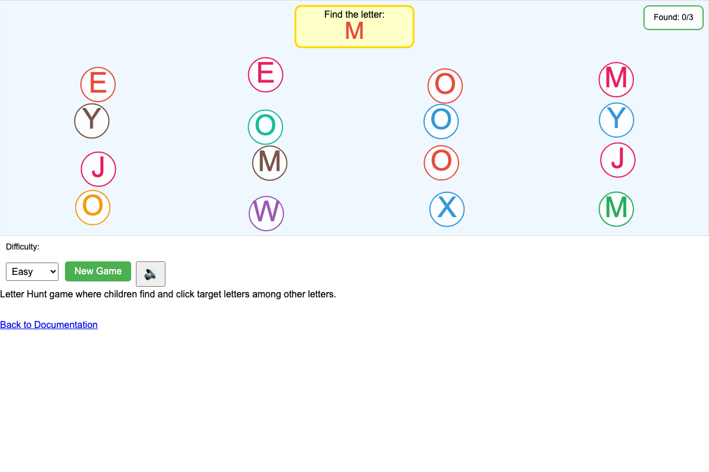
    Find and click target letters hidden among other letters in a playful search-and-find game.

- **[Letter Tracing](./letter-tracing/index.md)**

    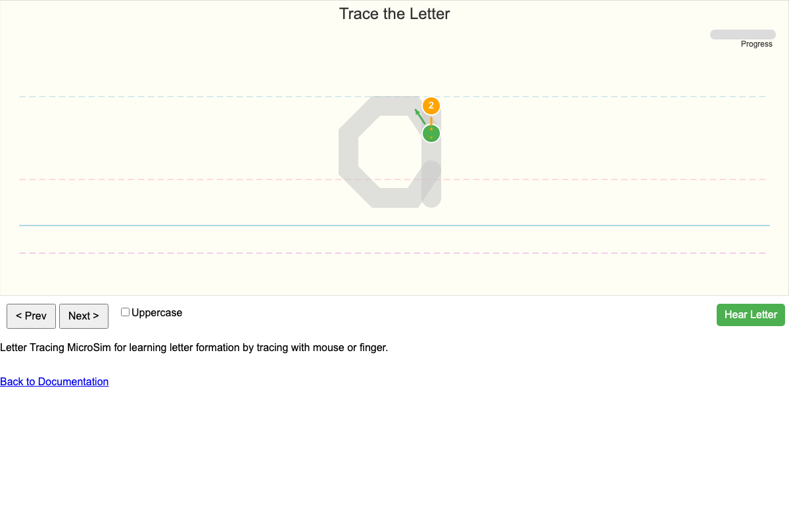
    Trace letters with finger or mouse to learn proper letter formation and stroke order.

## Phonemic Awareness

- **[First Sound Finder](./first-sound-finder/index.md)**

    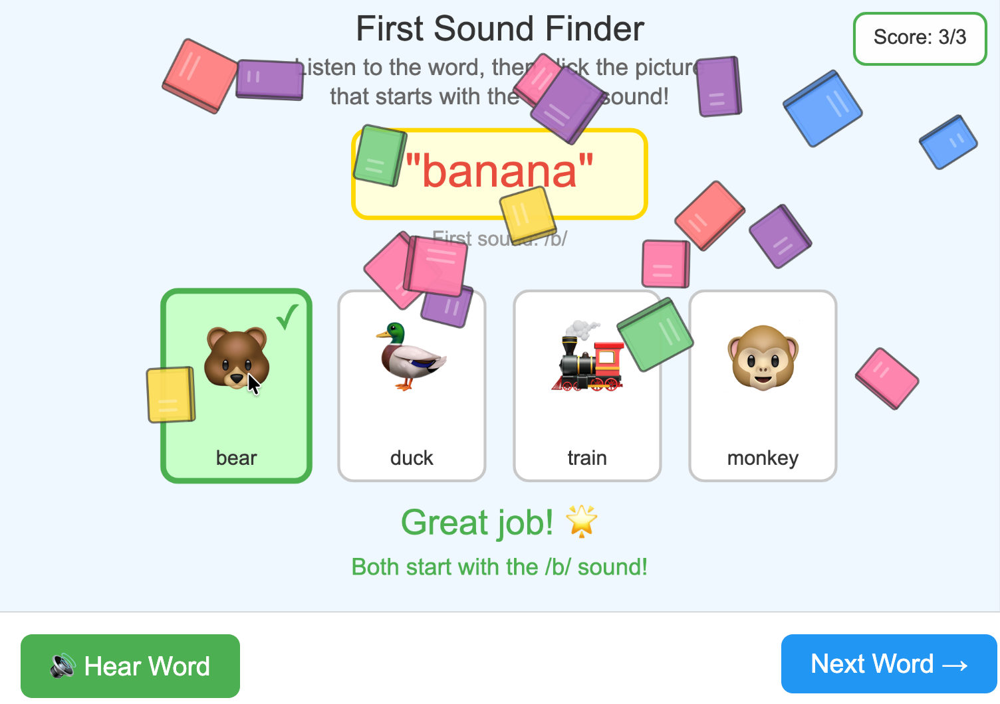
    Listen to a word and identify the first sound from multiple picture choices.

- **[Sound Counter](./sound-counter/index.md)**

    
    Count phonemes in spoken words by tapping or clicking for each sound heard.

- **[Word Counter](./word-counter/index.md)**

    
    Count words in sentences by tapping once per word, teaching one-to-one correspondence.

- **[Rhyme Time](./rhyme-time/index.md)**

    
    Match words that rhyme together in a fun drag-and-drop pairing game.

## Letter-Sound Correspondence

- **[Consonant Sound Match](./consonant-sound-match/index.md)**

    
    Click consonant letters to hear their most common sound with example words and pictures.

- **[Vowel Sound Explorer](./vowel-sound-explorer/index.md)**

    
    Interactive vowel chart showing short and long sounds with visual and audio examples.

- **[Sound-to-Letter Match](./sound-to-letter-match/index.md)**

    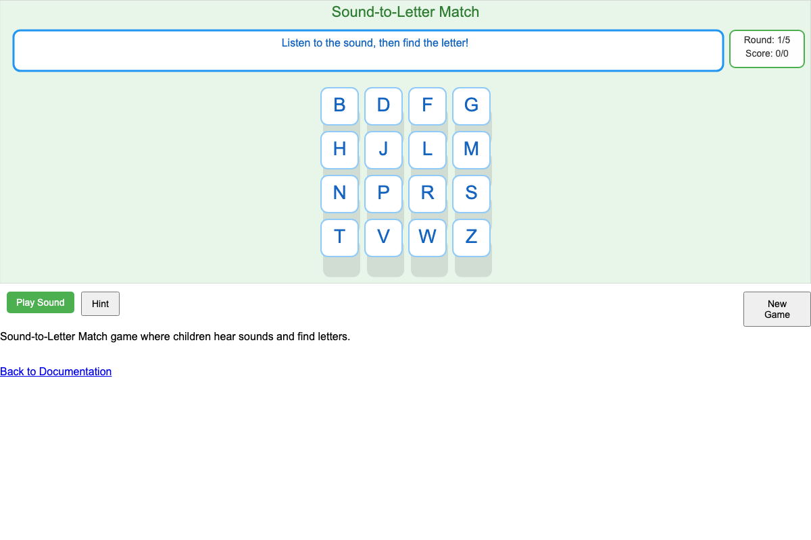
    Hear a sound and click the letter that makes it—the inverse of letter-to-sound practice.

- **[Letter Sound Keyboard](./letter-sound-keyboard/index.md)**

    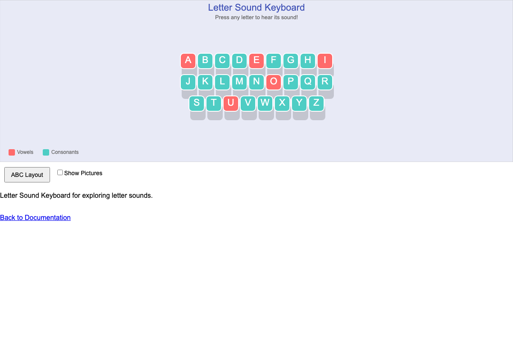
    Virtual keyboard that plays letter sounds when keys are pressed for playful exploration.

## Blending

- **[CVC Word Builder](./cvc-word-builder/index.md)**

    
    Drag letters to build consonant-vowel-consonant words with audio blending support.

- **[VC Word Blender](./vc-word-blender/index.md)**

    
    Blend vowel-consonant combinations as a stepping stone to full CVC word reading.

- **[Sound Slider](./sound-slider/index.md)**

    
    Slide through sounds to blend them into words using a visual slider control.

- **[Word Machine](./word-machine/index.md)**

    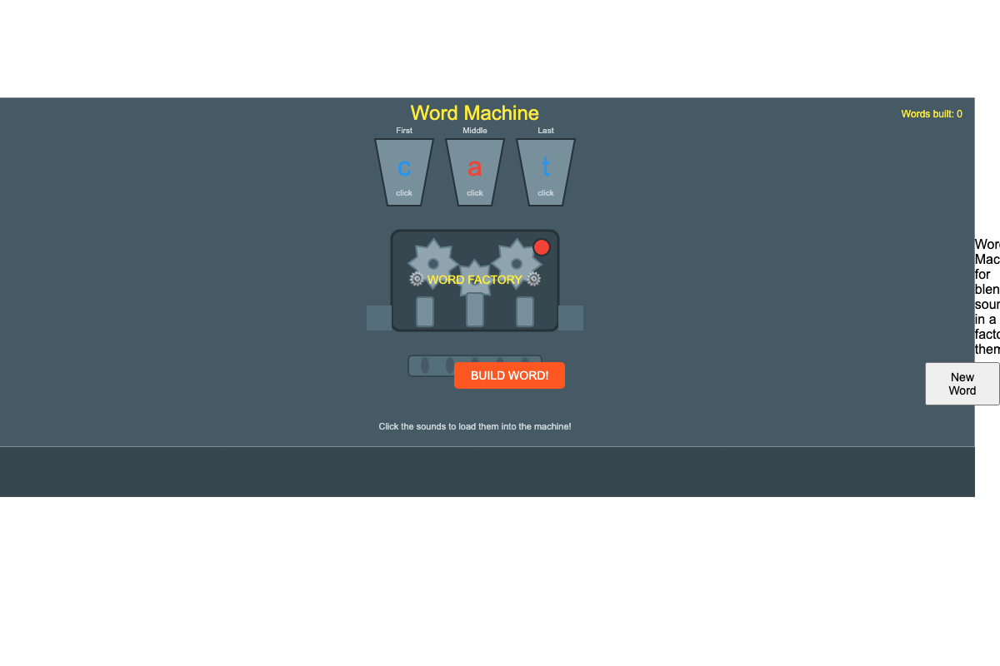
    Factory-themed animation where sounds go in and blended words come out.

## Sight Words

- **[Sight Word Flashcards](./sight-word-flashcards/index.md)**

    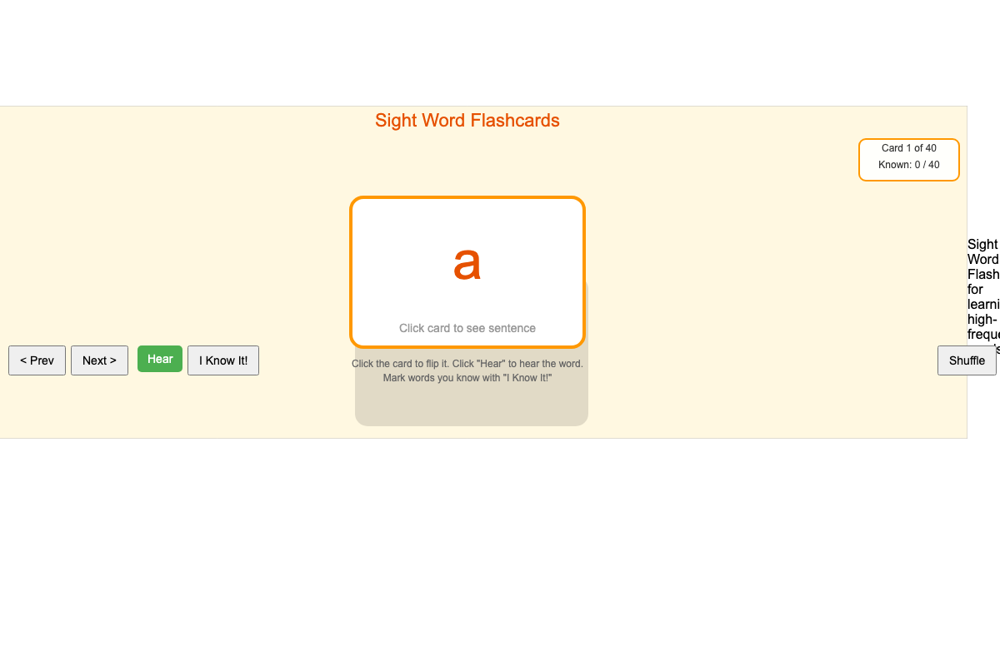
    Interactive flashcards for high-frequency Dolch sight words with audio pronunciation.

- **[Sight Word Memory](./sight-word-memory/index.md)**

    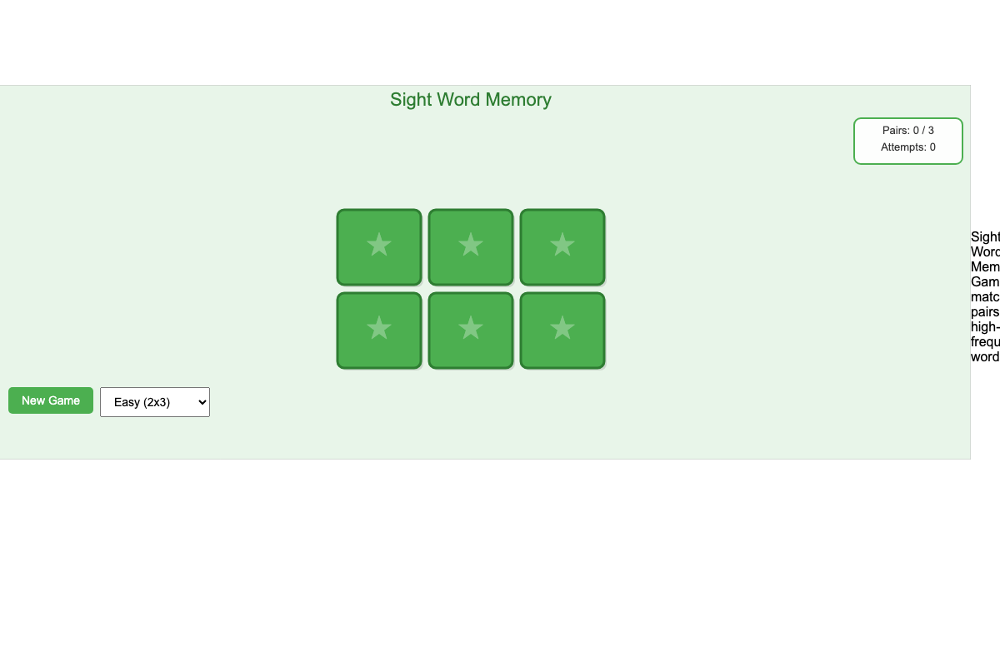
    Match pairs of sight word cards in a classic memory game with three difficulty levels.

- **[Sight Word Bingo](./sight-word-bingo/index.md)**

    
    Listen and find sight words on a bingo card—combining listening and visual recognition.

## Multi-Skill Games

- **[Nonsense Word Generator](./nonsense-word-generator/index.md)**

    
    Build and sound out made-up CVC words to practice pure decoding without context clues.

- **[Letter Motion Maker](./letter-motion-maker/index.md)**

    
    Associate body movements with letter shapes for kinesthetic learning and movement breaks.

- **[Reading Progress Path](./reading-progress-path/index.md)**

    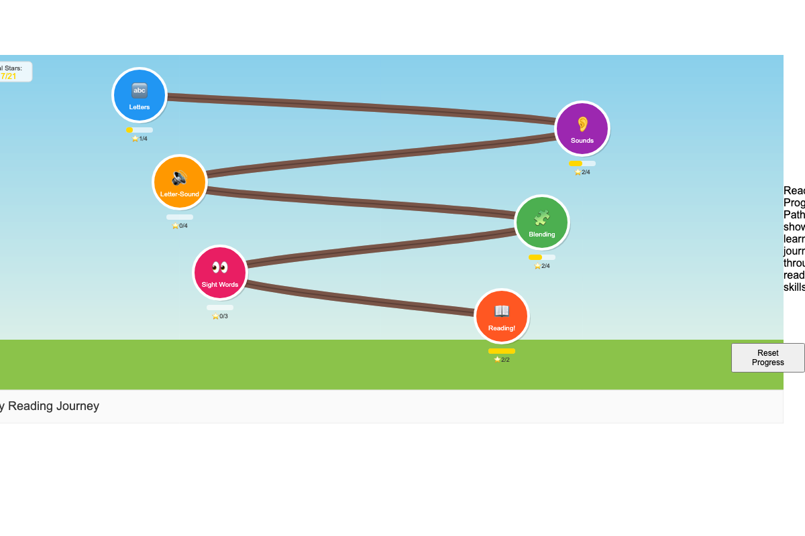
    Visual journey through all reading skills with progress tracking and skill connections.

## Developer Tools

- **[Graph Viewer](./graph-viewer/index.md)**

    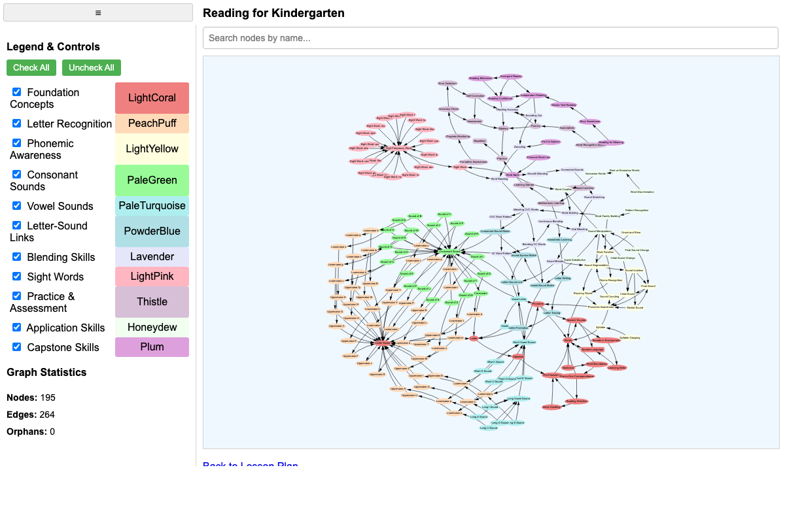
    Interactive visualization of the learning graph showing concept dependencies.

- **[Celebration Animation Tester](./celebration-animation-tester/index.md)**

    
    Testbed for celebration animations used to reward student achievements.

- **[Animation Library Tester](./animation-lib-tester/index.md)**

    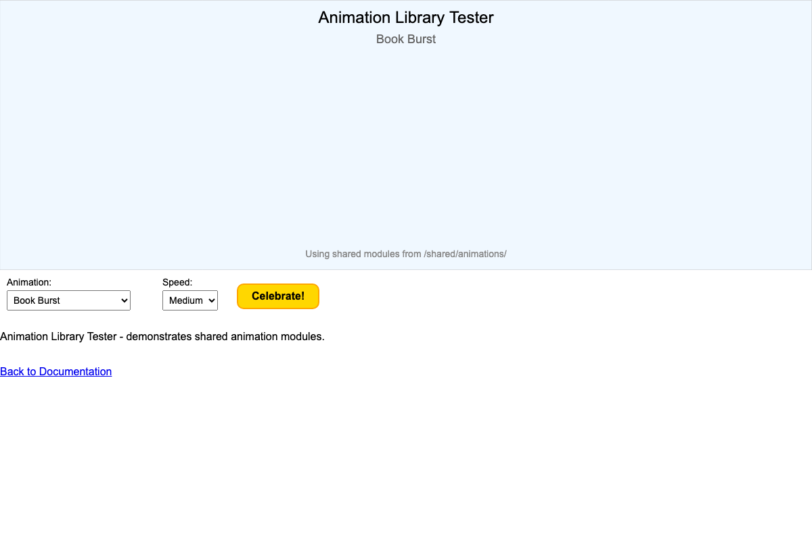
    Demonstrates shared animation library modules for MicroSim development.

See [Shared Animation Library](./shared/animations/index.md) for reusable celebration effects.

## Reusable Patterns

Several MicroSims include reusable code patterns that can be adapted for new simulations:

- **Celebration Animations** - Sparkles, confetti, star effects for rewards
- **Audio Feedback** - Correct/incorrect sounds, success fanfares using Web Audio API
- **Speech Synthesis** - Letter sounds, word pronunciation, instructions
- **Drag and Drop** - Touch-friendly tile manipulation
- **Progress Tracking** - Stars, counters, completion states

## List of Possible MicroSims

See the [List of Possible MicroSims](./possible-microsims.md) for additional ideas and proposed simulations.
